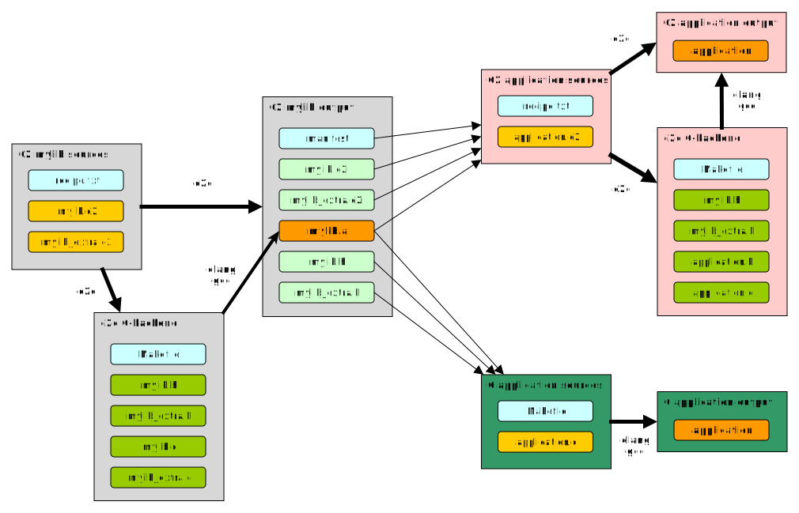

C2 is an *evolution* of C. So one design criterion would be easy integration with
existing C libraries. This section explains how C2 integrates external C libraries.

## C/C++ library support
Let's start this section by first looking at existing library support in C (or C++).
The first thing to realize is:

__C does not have true library support!__

This may sound weird considering that there thousands of C libraries out there.
But the C-*language* doesn't know the concept of libraries. Using libraries in C consists
of several *separate* steps:

* including a header file that's just copy-pasted into your source file, like any other
*#include*
* passing some extra flags to the linker to tell it to include a dependency or extra
object files.

Both steps also have some supporting features like setting search paths for headers/libraries etc.
You can forget either of the steps. For example, forgetting the second step will usually result in some
cryptic *undefined reference to X* errors during linking. So it's up to the programmer to
do both steps.

## C2 library design
In C2, the compiler does have a concept of a library. So using a library is more of an
atomic action; either you use it or not. Also every library in use needs to be specified
in the recipe file. There is one exception to this rule: usage of *libc* is opt-out. By
default each program uses it. This is a convenience choice.

c2c uses an environment variable called *$C2_LIBDIR* indicating the directories where
libraries can be found. Paths are separated by ':' (eg C2_LIBDIR=/foo:/bar:/faa).
In these directories, each library has its own subdirectory, as shown below.

```bash
c2libs/
├── libc
│   ├── c_errno.c2i
│   ├── manifest.yaml
│   ├── stdio.c2i
│   ├── stdlib.c2i
│   ├── string.c2i
│   ├── sys_stat.c2i
│   ├── sys_time.c2i
│   ├── (some files removed for brevity)
│   └── unistd.c2i
├── math
│   ├── manifest.yaml
│   └── math.c2i
├── pthread
│   ├── manifest.yaml
│   └── pthread.c2i
```

To be valid, a library directory has to contain a *manifest.yaml* file and one or
more *interface* or *source* files.

C2 supports three types of libraries: __dynamic__, __static__ and __source__. (see below)

### manifest file
Since C2 doesn't use *#include* headers, a new mechanism is required to map C header
files to C2 modules. This is the purpose of a *manifest* file.

```yaml
# C2 wrapper for the standard C library

info:
    language: c
    type: library
    kinds:
        - static
        - dynamic

modules:
    - c_errno
    - csetjmp
    - csignal
    - stdio
    - ...
```

The manifest file uses the [YAML-format](https://yaml.org). The
key-values under *info* describe the generic setting for that library. For *langugage*
there can be two options: C or C2. Using C indicates that symbol-generation should not
prefix the declaration name with the module name. For example: *printf* simply becomes
the symbol *printf*, not *stdio_printf*.

The rest of the file maps specific C header files to C2 modules. Optionally, the *header*
line describes which C header should be included by the C generation back-end.

It's also possible to specify dependencies of a library in the manifest file:

```yaml
...

dependencies:
    libc: dynamic
    math: dynamic

...
```

To specify the link name to use (what is passed to -l option, eg -lmyname)

```yaml
info:
    language: c
    type: library
    linkname: myname
    kinds:
        - dynamic
    linkname = "z"
```


### Interface files
While C2 does not have header files or an *#include* mechanism, it does have *interface*
files. These are similar to regular .c2 files, except for:

* they have the .c2i extension (c2 interface, get it?)
* functions can not have a body
* every declaration is public by default
* the filename (without the ".c2i" extension) must match the module name inside ( eg.: foo.c2i -> module foo; )
* there can be only one file per module

For example, a fraction of *stdio.c2i* looks like this:

```c2
module stdio;

import c2 local;

FILE* stdin;
FILE* stdout;
FILE* stderr;

fn c_int fclose(FILE* __stream);
fn c_int fflush(FILE* __stream);
fn c_int fprintf(FILE* __stream, const c_char* __format, ...);
fn c_int printf(const c_char* __format, ...);
fn c_int sprintf(c_char* __s, const c_char* __format, ...);

// .. (stuff left out)
```
C2 has special types for creation of interface files for C libraries. These are defined in the C2 module:

* c_char
* c_int
* c_uint
* c_long
* c_ulong
* c_size
* c_ssize
* c_longlong
* c_float
* c_double

## Library types
C2 project can use external libraries by specifying ```$use lib <type>``` in the recipe file.
Type can be dynamic, static or source.

### Dynamic
Dynamic libraries are loaded at __runtime__ by the loader. During building, the interface files are
parsed to be able to verify the calling code.

### Static
Static libraries are linked at __build-time__ by the linker. After that, they no longer exist as a
dependency.

### Source
Source libraries are libraries that only consist of .c2 sources. These sources are just like normal
.c2 source files. In the manifest, one or more modules must be exported. There are allowed to be used
by the user program.

Source libraries allow full program optimization *including* libraries. This can be especially advantageous
if the interface is a high-speed interface (ie many, many calls per second).

Unused functions/variables in libraries are not placed in the resulting binary.


## C2 library build process

One of the goals of C2 is tight intergration with plain old C. So when building a
library with C2, the developer has the option to either generate interface files for
C, for C2 or for both. For C, this will mean generating *header-files*. For C2 this
will mean generating a *manifest* and *.c2i files*.

To make the situation a bit more complex, C2C also has a C-backend. So internally
it can generate .c/.h files to build targets. These header files should not be
confused with the interface header files described above. To explain, see the image
below.

A lot of things are happening here, so please take some time to study the image.
In general, 3 things are shown:

* build a C2-library called *mylib* (shown in grey boxes)
* build a *C2*-application that uses mylib (shown in pink boxes)
* build a *C*-application that uses mylib (shown in dark green boxes)

Let's look at each of these in turn.
###building mylib
The box *C2 mylib sources* contains all the source files for the library. Using
c2c, these are transformed into the results in *C2 mylib output*.

To support C2 client programs, c2c optionally generates the *manifest*, *mylib.c2i*
and *mylib_extra.c2i*. For C client programs, c2c can generate *mylib.h* and *mylib_extra.h*.
Also the library itself *mylib.a* (in this case a static lib) is generated.

Currently c2c uses a C-backend. This means that the C2 sources are transformed into
C and then compiled using clang/gcc. This part is shown in the *c2c C-backend* box.

###building C2-application
So now we have a library and some c2 interface files. At this stage, we might be
somebody else and not even have the sources. For the application, the developer
writes *application.c2* and adds the mylib dependency in the *recipe* file. c2c
will take care of the rest and generate the *application-binary*

The recipe with a dependency looks like:

```
executable myapp
    $use mylib static
    myapp.c2
end
```
So the user of a lib must specify whether to use the dynamic/static version.


###building C-application
The same library can also be used by C programs, by simply including the *mylib.h*
and *mylib_extra.h* in *application.c*. This is no different than using any other
C library.

##advantages of integrated library support

There are several additional advantages of integrating library support in the language

###Library finding
c2c has an option *--showlibs* that searches the library paths and simply prints all
available libraries on a system. Handy for those tiny libs that always go missing.

###Dependency checking
The compiler can actually check if you really need some library and give a warning
otherwise. This avoids any unnecessary dependencies.

###Full symbol mapping
The compiler can generate a full dependency map of all symbols, including external
ones. This allows better insight into the code structure.

###c2tags
*c2tags* is a tool that allows editors to 'jump to definition' of any symbol. Because
of the interface files, that describe external symbols, editors have a place to jump
to for all symbols. This is a very powerful feature. Never mess with ctags files
ever again.


