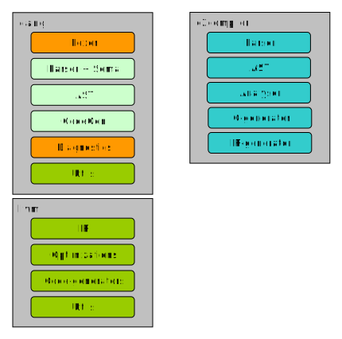

This section describes how the C2 compiler (c2c) is structured.

Each component will be described in detail below. The colors mean:

- green: used unmodified
- light blue: not used
- blue: new components
- orange: modified from the original

### LLVM
The [LLVM Project](http://llvm.org) provides great building blocks for
compilers. Just what we need!

__IR__ (Intermediate Representation) is roughly an assembly-like language
and is used as input for LLVM. On the IR code, various optimizations can be
applied and code can be generated for various targets (like ARM, PowerPC, X86, etc.).
Additionally the LLVM code holds much utility functionality.

For C2 we use the LLVM unmodified!

### Clang
[Clang](http://clang.llvm.org) is a C/C++/Objective-C compiler that uses
LLVM as its back-end. Very briefly, it works like this:

Clang has a __Lexer__ that provides symbols to the __Parser__. The Parser then calls
the  __Sema__ (Semantic Analyser) to do analysis and build up the __AST__ (abstract syntax tree).
The __CodeGen__ components take the __AST__ and convert it into __IR__ code for LLVM.
For this, there are various Util libraries and a __Diagostics__ component to
display beautiful error messages.

Both LLVM and Clang are compiled into roughly 50 static libraries that can
be linked into other applications.

__designer's note__:

C2C does not use Clang's AST and Parser/Sema. This would have provided a *lot* of
functionality out of the box. However, since C2 does not have forward declarations
and does not require any ordering on file level, a multi-pass analysis is required.
This does not fit into Clang's infrastructure all, since it is based on C-like
languages, where can be just a single pass compilation.

### C2 Compiler
C2 has it's own __Parser__ that uses Clang's __Lexer__. The __Parser__ builds up
the __AST__ via a very small __Sema__ (Semantic Analyser). Not much analysis can
be done after the parsing phase, since all .c2 files need to be parsed before
proper analysis can start.

After parsing all files, the __Analyser__ will start its multi-pass analysis over
all files. Since C2C has the full build-scope, it can provide very detailed diagnostics,
like which fields on a struct are unused, etc

C2C has two back-ends; one that generates Ansi-C code and a second one that generates
LLVM's IR code.

