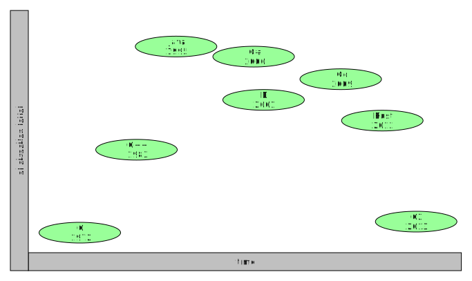

### philosophy
*"The C programming language has been around for a long time and is still used
a lot nowadays. The core of the language is very solid, but other aspects
are showing their age. C2 attempts to modernize these parts, while keeping
the feel of C. It should be seen as an __evolution__ of C."*

### design goals
This philosophy leads to the following design goals:

* __higher__ development speed
* same/better speed of execution
* better compilation times
* integrated build system
* stricter syntax (easier for tooling)
* great tooling (formatting tool, graphical refactoring tool)
* easy integration with C libraries
* should be easy to learn for C programmers
* should support avoiding common mistakes

As such, since C2 is an __evolution__ of C, it has explicit __non goals__:

* higher-level features (like object-orientation, garbage collection, etc)
* completely new language

### advantages
So *Why* would you choose C2 over C?

* __faster__ development. Our tests show around __30%__ decrease in development time!!
* easy access to features like LTO (link-time optimization)
* better diagnostics (again speeds up development)
* easier control over *architecture* with __c2reto__

### domain
new programming languages appear quite frequently nowadays. For example
__D__, __Rust__, __Go__, __Swift__, just to name a few of the big names.
Each of these try to solve problems in a specific *domain*. For example,
both __D__ and __Rust__ aim to be *system-level* programming languages,
so a valid alternative to C++.

*C2 aims to be used for problems where currently C would be used*. So low-level
programs, like bootloaders, kernels, drivers and system-level tooling.

### programming language evolution

In programming language development, there has been a trend towards higher-level,
more abstraction. Java and C# especially reflect this trend. For system-level
languages, D and Rust have reverted some of this trend, to give better performance and
control. For a system-level language, the features offered by C++, D and Rust are
very suitable. However, they do not seem to fill the gap for low-level/embedded
programs, since these are often still programmed in C. This gap is exactly one
that C2 attempts to fill.

